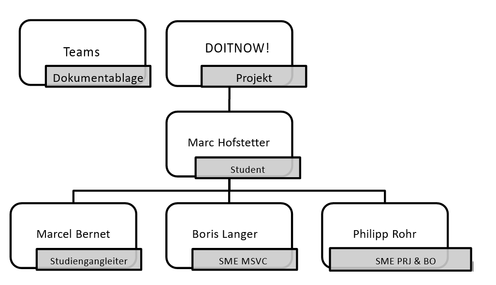

# 3.2 Projektorganisation

Die folgende Grafik stellt den Aufbau meines Projektes dar.  

## 3.2.1 Rollenbeschreibung

### Projekt und Student

Das Projekt wird aufgebaut und durchgeführt von Marc Hofstetter. In der Scrum Projektmethode ist Marc Hofstetter somit den Product Owner und Scrum Master.
Die Aufgaben des Product Owners ist es das Projekt so zu führen, dass die Anforderungen des Business Owners umgesetzt werden.
Die Aufgaben des Scrum Masters ist es das Agile Team zu führen und vertritt dieses nach aussen.

## SME (Subject Matter Expert)

Der SME ist der Experte, welcher das Projekt durch ein breites Fachwissen unterstützt.

## BO (Business Owner & Stakeholder)

Der Business Owner arbeitet eng mit dem Product Owner zusammen, der die Anforderungen konkretisiert und in den Backlog des Projekts einpflegt. Der Product Owner ist dafür verantwortlich, diese Anforderungen mit dem agilen Team zu planen und umzusetzen. Gemeinsam sorgen der Business Owner und der Product Owner dafür, dass die entwickelten Lösungen nicht nur technisch umsetzbar, sondern auch geschäftlich relevant und wertvoll sind.

Durch diese enge Zusammenarbeit stellt der Business Owner sicher, dass das Projekt stets auf die Erzielung maximalen Geschäftswerts ausgerichtet ist. Das agile Team kann somit effizient arbeiten und liefert regelmäßig Ergebnisse, die den Bedürfnissen des Unternehmens entsprechen.

Der Studiengangsleiter spielt in diesem Fall auch eine zentrale Rolle des Projekts. Er vertitt den Stakeholder (in diesem Fall die TBZ).
